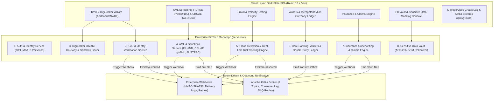

# ITFreeSource Academy | Enterprise FinTech Platform

[](https://github.com/itfreesource-academy/itfreesource-academy-fintech-platform)
[](LICENSE)
[](https://github.com/itfreesource-academy/itfreesource-academy-fintech-platform)
[](https://github.com/itfreesource-academy/itfreesource-academy-fintech-platform)
[](http://localhost:5001/api/docs)

An enterprise-grade, multi-service financial monorepo engineered by **ITFreeSource Academy**. Designed as a reference architecture for production financial systems, real-world automated QA testing (Playwright & REST Assured), and regulatory compliance engineering.

> [!CAUTION]
> ### ⚠️ LEGAL & REGULATORY DISCLAIMER: FOR EDUCATIONAL & ACADEMIC PURPOSES ONLY
> **This software is provided "AS IS" for pedagogical, educational, and automated QA testing reference only.**
> - **NOT A FINANCIAL INSTITUTION**: ITFreeSource Academy and contributors are NOT authorized banks, financial institutions, payment gateways, insurers, or regulatory advisors.
> - **NO REAL TRANSACTIONS / ZERO LIABILITY**: Does NOT process real fiat currency, legal tender, or real insurance policies. The authors assume **ZERO LIABILITY** for any direct, indirect, incidental, or consequential damages resulting from the use or misuse of this codebase.
> - **100% SYNTHETIC DATA**: All names, Aadhaar numbers, PANs, DLs, and accounts are synthetic mock fixtures with zero real-world individuals.
> - **PUBLIC DOMAIN STATUTES**: All compliance thresholds (FIU-IND, CBUAE, AUSTRAC, UN) are derived exclusively from published official government gazettes and statutory regulations.
>
> 📖 **Read the complete binding terms**: [**LEGAL_DISCLAIMER.md**](./LEGAL_DISCLAIMER.md)

---

## 🌟 Architecture & Key Microservices



---

## 🏛️ Statutory Compliance & International Jurisdictions

All AML rules, thresholds, and reporting formats are derived directly from published public government statutes:

1. **🇮🇳 India — Financial Intelligence Unit (FIU-IND) & RBI (PMLA)**:
   - **Rule 114B Cash Mandate**: Single-day cash transactions $> \text{₹}50,000$ without verified PAN are automatically blocked.
   - **Rule 3 Cash Transaction Report (CTR)**: Single or aggregate cash $> \text{₹}10 \text{ Lakhs}$ triggers CTR filing.
   - **Rule 3 Cross-Border Wire (CBWTR)**: Cross-border wires $> \text{₹}5 \text{ Lakhs}$ logged for regulatory dispatch.
   - **Sub-Threshold Structuring / Smurfing**: Detection of deposits between $\text{₹}49,000$ and $\text{₹}49,999$ attempting to bypass the $\text{₹}50,000$ PAN rule.

2. **🇦🇪 UAE — Central Bank of the UAE (CBUAE) & UAE FIU**:
   - **High Cash Transaction (HCT)**: Cash transactions $\ge \text{AED } 55,000$ trigger statutory alerts and generate download-ready **UNODC goAML XML** payloads.

3. **🇦🇺 Australia — AUSTRAC**:
   - **Threshold Transaction Report (TTR)**: Transactions $\ge \text{AUD } 10,000$ flagged for AUSTRAC reporting.

4. **🌐 Global — FATF, UN Security Council & Interpol**:
   - Automated screening for Politically Exposed Persons (PEP) and international sanctions.

5. **🇮🇳 Privacy — Digital Personal Data Protection (DPDP) Act 2023**:
   - AES-256-GCM hardware encryption enclave, dynamic masking (`XXXX-XXXX-1234`, `ABCDE****F`), surrogate tokenization (`tok_pan_...`), and Section 12 Right-to-be-Forgotten cryptographic shredding.

---

## 👥 The 8 Core Sandbox Personas

| Role | Name | Clearance | Focus Area |
| :--- | :--- | :--- | :--- |
| `compliance_officer` | **Maya Lin** | Tier 1 | FIU-IND Rule 114B review, CBUAE goAML XML export, KYC approval |
| `risk_analyst` | **David Vance** | Tier 2 | Multi-vector fraud scoring, impossible travel analysis, velocity monitoring |
| `underwriter` | **Sarah Chen** | Tier 2 | Insurance policy underwriting, actuarial pricing, claims fraud scoring |
| `fraud_investigator`| **Alex Morgan** | Tier 1 | Account freezing, headless automation blocking, device fingerprinting |
| `retail_customer` | **Vikram Sharma** | Tier 3 | Personal banking (INR/USD), verified Aadhaar/PAN, health insurance policy |
| `hni_customer` | **Julian Sterling** | Executive | Private wealth (AED/INR), large cross-border transactions |
| `pep_sanctioned_user`| **Vladimir Voronov**| Tier 3 | Simulated Politically Exposed Person (UN Security Council Watchlist) |
| `auditor` | **Victoria Taylor** | Tier 1 | Read-only regulatory audit, PII access logs, double-entry reconciliation |

---

## ⚡ Quick Start & Development

### 1. Prerequisites
- Node.js $\ge 18.0.0$
- npm $\ge 9.0.0$

### 2. Install & Run Locally
```bash
# Clone the repository
git clone https://github.com/itfreesource-academy/itfreesource-academy-fintech-platform.git
cd itfreesource-academy-fintech-platform

# Install monorepo dependencies
npm run install:all

# Run both Server (port 5001) and Client (port 3001) concurrently
npm run dev
```

### 3. Run Automated Vitest Test Suites
```bash
# Run all 8 test suites (28 tests across KYC, AML, Fraud, Ledger, PII, Kafka, Webhooks)
npm test
```

### 4. Interactive OpenAPI 3.0 Documentation
Once the server is running, open:
- Swagger UI: `http://localhost:5001/api/docs`
- OpenAPI JSON: `http://localhost:5001/api/swagger.json`
- Healthcheck: `http://localhost:5001/api/v1/system/health`

---

## 🚀 Deployment Targets

### Cloudflare Pages & Workers
This monorepo compiles into a single edge artifact:
- Build command: `npm run build`
- Output directory: `dist/`
- Edge Worker: `worker.ts` with `wrangler.toml`

---

## 🔗 Companion Test Harnesses

- **Playwright Test Harness**: [fintech-playwright-ts-harness](https://github.com/itfreesource-academy/fintech-playwright-ts-harness)
- **CI/CD Shared Library**: [fintech-jenkins-shared-library](https://github.com/itfreesource-academy/fintech-jenkins-shared-library)
- **Book Store Reference**: [itfreesource-academy-book-store](https://github.com/itfreesource-academy/itfreesource-academy-book-store)
